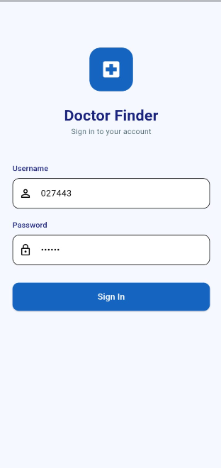
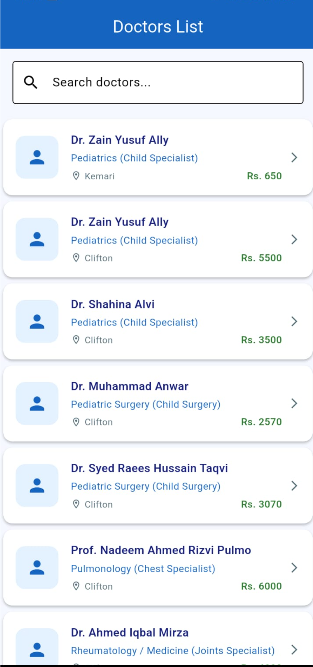
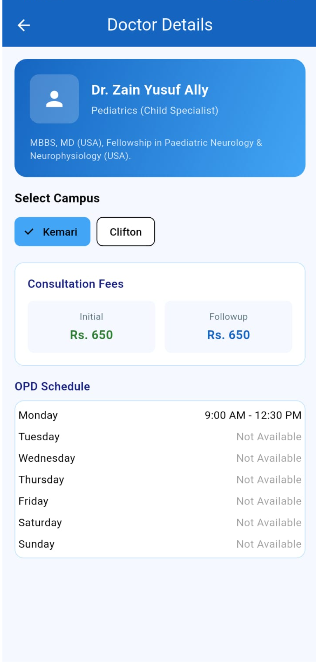

# Doctor Finder App

A professional Flutter healthcare application to find and see doctor details.
Built with clean architceture and Riverpod state management.

## Screenshots

| Sign In | Doctor List | Doctor Detail |
|---------|-------------|---------------|
|  |  |  |

## Features
- Real hospital API integration
- Doctor search by name
- Campus selector with OPD schedule
- Consultation fee display
- Clean authentication flow

## Tech Stack
- Flutter
- Riverpod (State Management)
- Dio (HTTP Client)
- Clean Architecture

## Architecture
lib/
├── core/
│   └── theme/
├── features/
│   ├── auth/
│   │   ├── data/
│   │   ├── domain/
│   │   └── presentation/
│   └── doctors/
│       ├── data/
│       ├── domain/
│       └── presentation/
└── main.dart

## State Management
- NotifierProvider → Sign In flow
- FutureProvider → Doctor List & Details
- FutureProvider.family → Doctor Details with parameters
- StateProvider → Search & Campus selection

## Author
Fawad Ahmed
Senior Flutter Developer